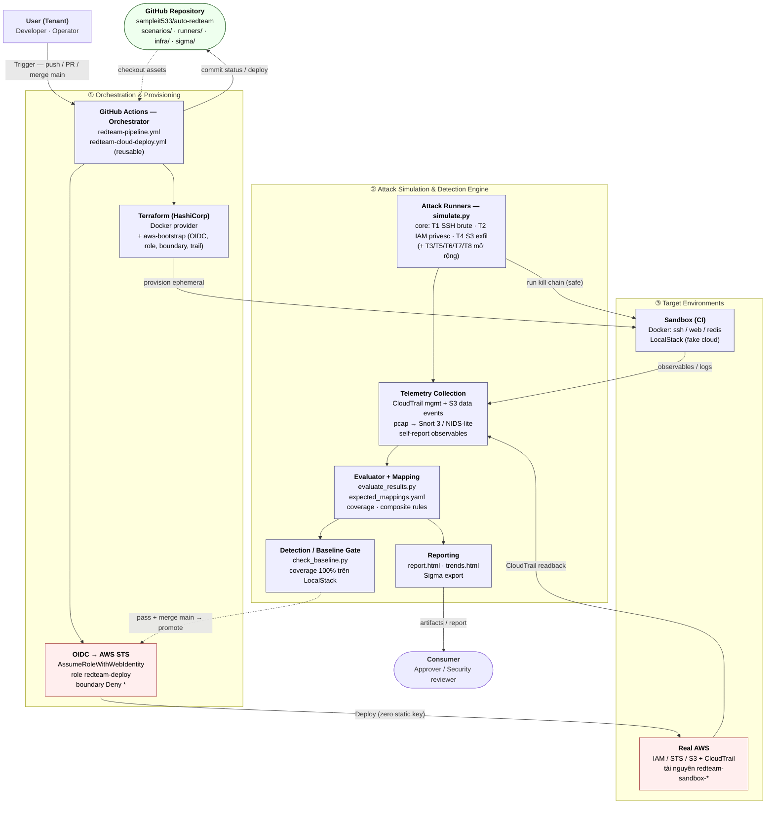
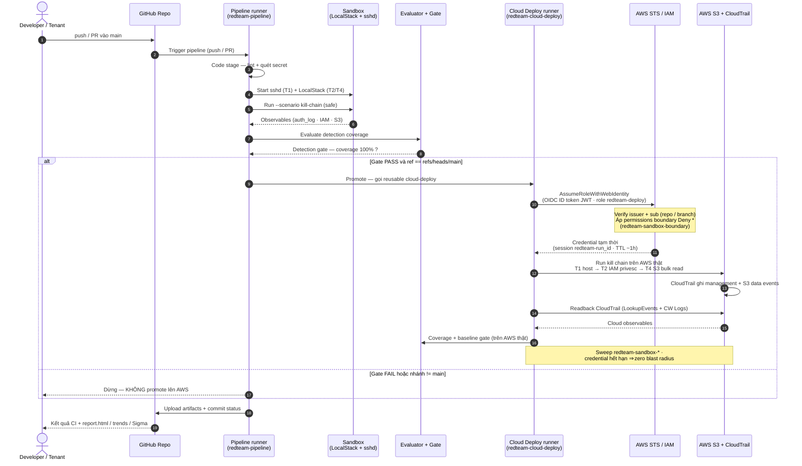

# Kiến trúc & Dataflow — auto-redteam (góc nhìn phân vùng)

> Các sơ đồ chi tiết khác (Hình 1 tổng thể, pipeline 3 stage, vòng đời 1 run, hạ tầng
> OIDC) vẫn nằm ở [`architecture.md`](architecture.md) — tài liệu này là bản bổ sung,
> không thay thế.

---

## Hình A — Kiến trúc & luồng dữ liệu (phân vùng)

Ba phân vùng chức năng (**Orchestration → Engine → Targets**) tương ứng với bố cục
*Pre-configuration → Central Engine → Post/Target* của mẫu tham khảo. Actor **User
(Tenant)** đứng dưới cùng kích hoạt pipeline; **Approver / Security reviewer** là
**consumer** của báo cáo.

---

## Hình B — Sequence: luồng định danh động & deploy lên AWS thật (OIDC)

Tương ứng với sequence diagram "token-exchange / JIT credential" của mẫu tham khảo,
nhưng đây là **luồng GitHub-OIDC thật** của đồ án: runner đổi **OIDC ID token (JWT)**
lấy **credential tạm thời** từ AWS STS, chạy kill chain T1→T2→T4 trên AWS thật, đọc
ngược CloudTrail để đánh giá, rồi tự dọn dẹp. Permissions boundary `Deny *` + TTL
credential đóng vai trò "zero blast radius".

---

## Ánh xạ với mẫu tham khảo

| Vai trò trong mẫu tham khảo | Thành phần tương đương ở auto-redteam |
|---|---|
| Pre-configuration (Control Node, Terraform, IdP/STS) | ① Orchestration: GitHub Actions + Terraform + GitHub OIDC → AWS STS |
| Central Security & Triage Engine (Scanner → SIEM → OPA) | ② Engine: simulate.py runners → Telemetry collection → Evaluator + **Detection/Baseline gate** (vai trò "policy/triage") |
| Action Dispatcher / Ticketing / ChatOps | Reporting (report.html · trends · Sigma export) + commit status trên PR |
| Post-configuration (Drift Detection, Revert) | Teardown / Sweep (`if: always()`) + baseline regression gate |
| Target Environment (OpenStack / AWS) | ③ Targets: Sandbox Docker + LocalStack (CI) và **AWS thật** (IAM/STS/S3 + CloudTrail) |
| Keycloak + Vault + STS Hub + RFC 8693 token-exchange | **GitHub OIDC native** (`AssumeRoleWithWebIdentity`) — không cần broker; boundary `Deny *` + TTL thay cơ chế JIT 15 phút |
