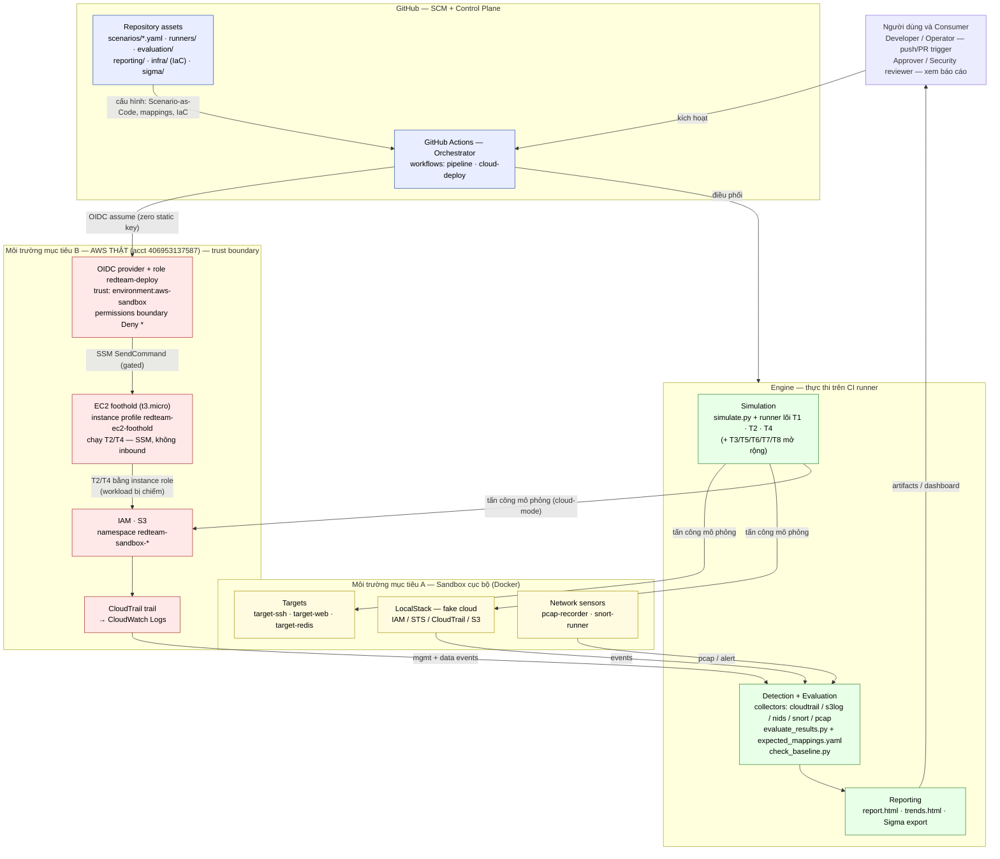
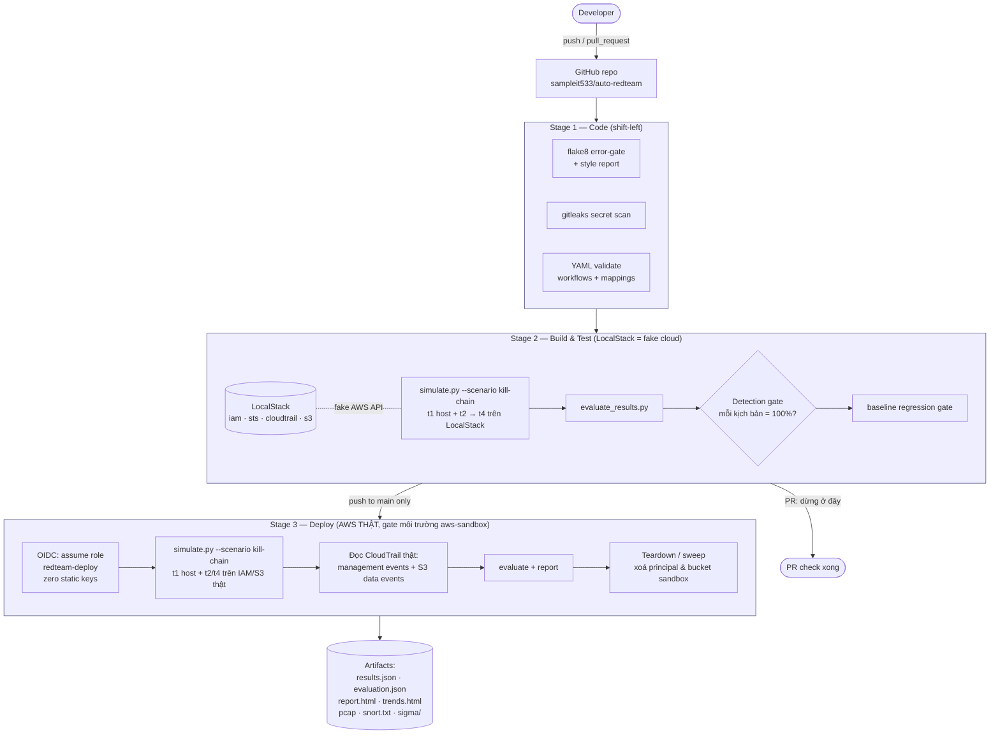
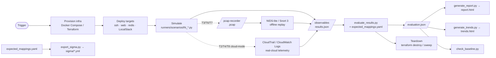
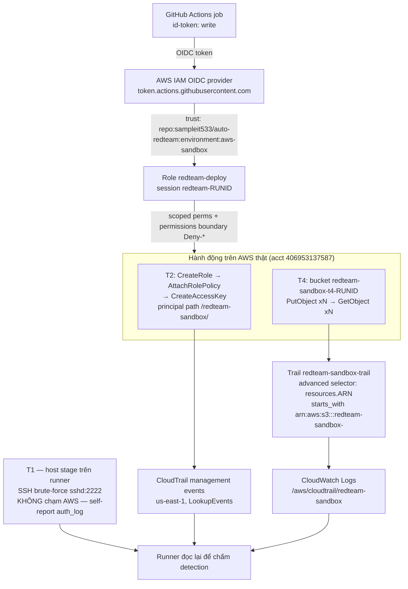
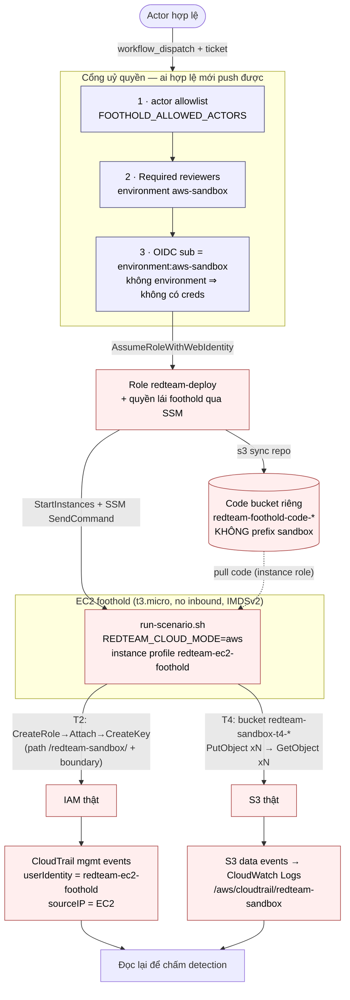

# Kiến trúc hệ thống — auto-redteam (cập nhật 2026-05-27)

Tài liệu này vẽ lại kiến trúc **hiện tại** của đồ án sau khi bổ sung kịch bản
T7/T8 và chuỗi kill chain chạy trên **AWS thật**. Nó thay cho các sơ đồ cũ
(`pipeline_architecture.svg`, `data_flow.svg`) và mục "Architecture" rút gọn trong
`README.md`.

> Đồ án = **Red Team Automation trong CI/CD** (Đề tài 16). Triết lý cốt lõi:
> *Continuous Detection Validation* — đưa việc kiểm chứng khả năng phát hiện tấn
> công vào pipeline như một stage tự động.

---

## Sơ đồ kiến trúc đồ án (Hình 1)

Đây là **sơ đồ kiến trúc chính, duy nhất** của đồ án — góc nhìn **cấu trúc + triển khai**:
các thành phần được nhóm theo **vùng tin cậy / môi trường triển khai** (GitHub control
plane, engine chạy trên CI runner, và hai môi trường mục tiêu: sandbox Docker + AWS thật),
cùng quan hệ giữa chúng. *(Các sơ đồ phía dưới — luồng thành phần, pipeline 3 stage, vòng
đời 1 run, hạ tầng OIDC — là góc nhìn **bổ trợ**, KHÔNG thay thế Hình 1.)*

**Cách đọc Hình 1:**
- **GitHub (control plane):** repo giữ toàn bộ assets (Scenario-as-Code, mappings, IaC, Sigma); GitHub Actions là bộ điều phối + cấp quyền OIDC.
- **Engine (trên CI runner):** simulation (lõi T1/T2/T4, + kịch bản mở rộng) → detection/evaluation → reporting.
- **Môi trường mục tiêu A (Docker sandbox):** targets + LocalStack (fake cloud) + network sensors.
- **Môi trường mục tiêu B (AWS thật):** role OIDC + permissions boundary `Deny *`, IAM/S3 sandbox, CloudTrail → CloudWatch Logs. **Hai cách chạy kịch bản trên AWS thật:** (a) trực tiếp từ CI runner qua OIDC; (b) **trên một EC2 foothold** — mô phỏng workload bị chiếm: CI dùng SSM ra lệnh chạy T2/T4 *trên* EC2, nên CloudTrail quy trách nhiệm về **instance role + IP của EC2** (xem §3b).
- **Quan hệ chính** (kiến trúc, không phải thứ tự thời gian): *kích hoạt*, *điều phối*, *OIDC assume*, *tấn công mô phỏng (act-on)*, *thu thập telemetry*, *sinh báo cáo*.

---

## Sơ đồ luồng thành phần (góc nhìn bổ trợ)

Sơ đồ khối ngang mô tả luồng các thành phần chính của hệ thống, từ trigger đến
báo cáo, kèm nhánh deploy lên AWS thật.

```mermaid
flowchart LR
    trig["<b>Trigger</b><br/>GitHub Actions<br/>• push / PR<br/>• merge main → deploy"]
    sandbox["<b>Sandbox &amp; Targets</b><br/>• Docker: ssh/web/redis<br/>• LocalStack (fake cloud)<br/>• AWS bootstrap (real)"]
    runners["<b>Attack Runners</b><br/>simulate.py<br/>• lõi T1/T2/T4 (+ mở rộng)<br/>• Scenario-as-Code (YAML)"]
    telem["<b>Telemetry Collection</b><br/>• CloudTrail mgmt+data<br/>• pcap → Snort / NIDS-lite<br/>• self-report observables"]
    eval["<b>Evaluator &amp; Mapping</b><br/>expected_mappings.yaml<br/>• ES-query / observable / composite<br/>• detection coverage"]
    gate["<b>Baseline &amp; Detection Gate</b><br/>check_baseline.py<br/>• gate 100% trước promote<br/>• chặn regression"]
    report["<b>Reporting</b><br/>• report.html<br/>• trends.html<br/>• Sigma export"]
    admin(["Security reviewer /<br/>Approver"])

    trig --> sandbox --> runners --> telem --> eval --> gate --> report --> admin

    deploy["<b>Real-AWS Deploy (OIDC)</b><br/>role redteam-deploy<br/>Kill chain T1→T2→T4 (t1 host, t2/t4 AWS)<br/>permissions boundary Deny *"]
    sweep["<b>Teardown / Sweep</b><br/>zero blast radius"]
    gate -. "merge main + env gate" .-> deploy
    deploy -- "CloudTrail readback" --> telem
    deploy --> sweep

    classDef box fill:#eef,stroke:#447,color:#000;
    classDef cloud fill:#fee,stroke:#a44,color:#000;
    class trig,sandbox,runners,telem,eval,gate,report box;
    class deploy,sweep cloud;
```

---

## 1. Pipeline CI/CD liên tục (góc nhìn vận hành)

Mỗi lần `push`/`pull_request` vào `main` kích hoạt `redteam-pipeline.yml`. Cùng một
chuỗi kịch bản được chạy trên **cloud giả (LocalStack)** để feedback nhanh, rồi mới
được "promote" lên **cloud thật (AWS)** khi merge vào `main`.

**Ba cổng kiểm soát (gates):**
1. **Code gate** — flake8 lỗi cú pháp/undefined + gitleaks (chặn secret) phải sạch.
2. **Detection gate** — chuỗi **kill-chain (T1→T2→T4)** trên LocalStack phải đạt
   **100%** coverage trước khi được promote; baseline gate chặn regression.
3. **Environment gate** — stage Deploy nằm sau môi trường `aws-sandbox` (có thể gắn
   reviewer để phê duyệt thủ công trước khi chạm AWS thật).

---

## 2. Vòng đời một lần chạy (góc nhìn dữ liệu)

Áp dụng cho mọi kịch bản, dù chạy local, trên LocalStack hay AWS thật:

**Nguồn telemetry → cùng một định dạng `observable`:**
- **Self-reported observables** — runner ghi trực tiếp (vd T1 auth_log; mở rộng: T5 audit_log).
- **Real-cloud telemetry** — CloudTrail management events (`LookupEvents`, cho T2)
  và S3 **data events** (CloudWatch Logs, cho T4). Đây là phần phát hiện *thật*.
- **Network sensor** *(mở rộng — T3/T6/T7)* — pcap (tcpdump) → NIDS-lite (T3/T6) hoặc
  Snort 3 (T7) → `nids_alert` / `snort_alert`.

Evaluator hỗ trợ 3 phong cách rule: ES-query style, observable-type style, và
**composite rule** (kiểm tra chuỗi event + principal + cửa sổ thời gian, dùng cho T2;
mở rộng: T5/T8).

---

## 3. Hạ tầng AWS cho stage Deploy

> Stage Deploy chạy `--scenario kill-chain` = **T1 (host) → T2 → T4**. T1 brute-force
> `sshd` ngay trên runner (không AWS); chỉ T2/T4 chạm AWS thật. Biến thể mở rộng
> `--scenario cloud` thêm **T8 Cloud Recon** (ListUsers/Roles/Policies +
> GetAccountAuthorizationDetails → management events) làm bước dẫn đầu.

**Nguyên tắc an toàn (zero blast radius):**
- **Không có static AWS key** — CI lấy quyền tạm thời qua OIDC, session đặt tên
  `redteam-<run_id>` nên truy được trong CloudTrail `userIdentity`.
- **Permissions boundary `Deny *`** gắn lên mọi principal do T2 tạo → chúng không
  làm được gì cả.
- Mọi tài nguyên nằm trong namespace `redteam-sandbox-*` / IAM path
  `/redteam-sandbox/` và **tự dọn** (sweep) sau mỗi lần chạy.
- Trail dùng **single-region us-east-1** + advanced event selector (selector cơ bản
  không nhận prefix tên bucket một phần).

---

## 3b. Foothold — chạy kịch bản trên EC2 thật (mô hình "compromised workload")

Ngoài cách chạy trực tiếp từ CI runner (§3), kịch bản **T2 (IAM privesc)** và **T4
(S3 bulk read)** có thể chạy **trên một EC2 thật** đóng vai *workload bị chiếm*. EC2
mang **instance profile** nên `boto3` tự lấy credential từ IMDS — **mã runner không
đổi một dòng**; chỉ *nơi phát lệnh* đổi, khiến CloudTrail quy trách nhiệm về
**instance role + IP của EC2** thay vì CI runner. Đây là câu chuyện adversary-emulation
sát thực tế nhất cho việc kiểm chứng phát hiện.

> **"Server thật" là bàn đạp của attacker, KHÔNG phải kho dữ liệu.** T4 vẫn rút từ
> **S3 thật** (`redteam-sandbox-*`) — đó mới là cái khiến `GetObject` là một CloudTrail
> *data event* phát hiện được. Bê data lên đĩa EC2 sẽ thành đọc file local, **mất sạch
> tín hiệu CloudTrail**. EC2 = compute/foothold, S3 = kho cloud thật — mỗi thứ đúng vai.

> Điều khiển qua **SSM Session Manager** (không mở port, không SSH key). EC2 **auto
> stop/start** theo lịch (EventBridge Scheduler) để giữ chi phí ~vài USD cho cả 3 tuần.
> Quyền của instance role được **tái dùng y nguyên** từ role deploy (chỉ IAM dưới
> `/redteam-sandbox/` + boundary, chỉ S3 `redteam-sandbox-*`) ⇒ "chiếm" được EC2 vẫn
> **zero blast radius**. Chi tiết: `infra/aws-bootstrap/foothold.md`.

---

## 4. Tổ chức repo (ánh xạ thành phần → thư mục)

| Thành phần kiến trúc | Thư mục / file |
|---|---|
| Orchestration (CI/CD) | `.github/workflows/` — `redteam-pipeline.yml`, `redteam-cloud-deploy.yml`, `redteam-foothold-run.yml` |
| Cổng uỷ quyền | `.github/CODEOWNERS`, OIDC trust `environment:aws-sandbox` (`infra/aws-bootstrap/main.tf`), required reviewers + actor allowlist |
| Scenario-as-Code | `scenarios/T1..T8_*.yaml` |
| Simulation runners | `runners/simulate.py`, `runners/scenarios/t1..t8_*.py`, `cloudtrail_util.py`, `s3log_util.py`, `nids_lite.py`, `snort_util.py`, `pcap_util.py` |
| Sandbox targets | `targets/` (docker-compose, ssh-target, pcap-recorder, snort-runner) |
| IaC hạ tầng | `infra/main.tf` (Docker), `infra/aws-bootstrap/` (OIDC, role, boundary, CloudTrail trail, `foothold.tf` EC2 + `run-scenario.sh.tftpl`) |
| Telemetry | `collection/filebeat.yml`, pcap/Snort/CloudTrail utils |
| Detection mapping & evaluator | `evaluation/expected_mappings.yaml`, `evaluate_results.py`, `check_baseline.py`, `baseline.json`, `export_sigma.py` |
| Sigma rules (export) | `sigma/*.yml` |
| Reporting | `reporting/generate_report.py`, `generate_trends.py`, `templates/` |
| Tài liệu vận hành/an toàn | `docs/` (approval_form, runbook, kill_switch, adding_scenarios, architecture, reports/) |

---

## 5. Bản đồ kịch bản → telemetry → detection

**Kịch bản cốt lõi (trọng tâm báo cáo) — chuỗi host → cloud:**

| ID | Kịch bản | MITRE | Target | Telemetry | Cách phát hiện |
|----|----------|-------|--------|-----------|----------------|
| T1 | SSH Brute-force (Initial Access) | T1110.001 | target-ssh | auth_log | đếm Failed password + Accepted |
| T2 | Privilege Escalation (IAM) | T1078.004 | LocalStack / **AWS IAM thật** | CloudTrail mgmt | composite: CreateRole→Attach→CreateKey, cùng principal, <5' |
| T4 | Bulk S3 Read / Exfil | T1530 | LocalStack / **S3 thật** | **CloudTrail data events** | ≥80 GetObject cùng principal |

**Kịch bản mở rộng (cùng framework, ngoài phạm vi cốt lõi):**

| ID | Kịch bản | MITRE | Target | Telemetry | Cách phát hiện |
|----|----------|-------|--------|-----------|----------------|
| T3 | Lateral Movement | T1021 | ssh/web/redis | connection_log + pcap | NIDS-lite fan-out ≥4 dst |
| T5 | CI Compromise | T1195.001 | observable-only | audit_log | composite: unauthorized_job + secret.read cùng actor <60s |
| T6 | Network Recon | T1046 | ssh/web/redis | scan_log + pcap | NIDS-lite ≥5 dst ports |
| T7 | Log4Shell N-day | T1190 | target-web | pcap → **Snort 3** | SID 1000001/2/3 `${jndi:...}` |
| T8 | Cloud Recon | T1580 | **AWS IAM/STS thật** | CloudTrail mgmt | composite: ListUsers/Roles/Policies/GetAcctAuthDetails |

**Chuỗi kill chain** (stage Deploy) chạy `--scenario kill-chain` = **T1 (Initial
Access — `sshd` trên runner) → T2 (PrivEsc) → T4 (Exfiltration)**; T2/T4 trên AWS thật
với cả hai loại bằng chứng CloudTrail (management + data events). Biến thể `--scenario
cloud` (**T8 → T2 → T4**, recon dẫn đầu) vẫn còn trong repo như kịch bản mở rộng.

**Nơi chạy T2/T4 trên AWS thật — hai biến thể (cùng một mã runner):**

| Biến thể | Định danh trong CloudTrail | Câu chuyện |
|---|---|---|
| CI runner qua OIDC (§3) | `assumed-role/redteam-deploy/redteam-<run_id>`, sourceIP = runner | "CI tự kiểm chứng" |
| **EC2 foothold qua SSM (§3b)** | `assumed-role/redteam-ec2-foothold/<id>`, **sourceIP = EC2** | **"workload bị chiếm tự leo quyền"** — sát thực tế |
