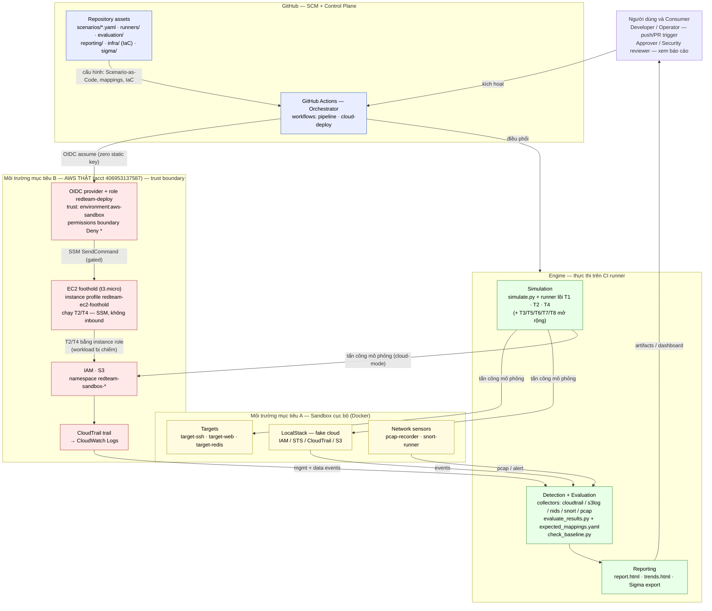

# PROJECT PROPOSAL

**Môn học:** Kiến trúc và Bảo mật Điện toán Đám mây

**Tên chủ đề:** Red Team Automation trong pipeline CI/CD — Tự động hóa kiểm thử tấn công mô phỏng và kiểm chứng khả năng phát hiện (detection) trên cloud

**Ngày báo cáo:** 27/05/2026

> *Ghi chú: bố cục & định dạng báo cáo theo mẫu chung của môn học; nội dung là đề tài
> **Red Team Automation** của nhóm (khác đề tài misconfig-remediation trong file mẫu).*

---

## 1. THÔNG TIN CHUNG

**Lớp:** NT524.Q21.ANTT

| STT | Họ và tên | MSSV | Email |
|-----|-----------|------|-------|
| 1 | Nguyễn Thế Anh | 23520066 | 23520066@gm.uit.edu.vn |
| 2 | Nguyễn Đa Vít | 23521802 | 23521802@gm.uit.edu.vn |

## 2. NỘI DUNG THỰC HIỆN

Phần bên dưới là tài liệu báo cáo chi tiết của nhóm.

---

# BÁO CÁO CHI TIẾT

## Mục lục

1. **Mục tiêu đồ án**
2. **Kiến trúc hệ thống**
   - 2.1. Trigger & Scheduler
   - 2.2. Sandbox & Target Environments
   - 2.3. Attack Simulation Runners
   - 2.4. Telemetry Collection
   - 2.5. Detection Evaluator & Mapping
   - 2.6. Baseline & Regression Gate
   - 2.7. Reporting & Sigma Export
   - 2.8. Real-AWS Deploy & Cloud Kill Chain
3. **Các kịch bản tấn công cốt lõi (T1, T2, T4)**
4. **Kết quả & đánh giá**
5. **An toàn & đạo đức**
6. **Đối chiếu outline và hướng mở rộng**

---

## 1. Mục tiêu đồ án

- Đề tài đề xuất thiết kế và hiện thực một **pipeline CI/CD chạy liên tục** để tự động
  hoá các kịch bản **tấn công mô phỏng (non-destructive)**, thu thập telemetry, và
  **kiểm chứng khả năng phát hiện (detection validation)** của hệ thống phòng thủ —
  theo mô hình *Continuous Detection Validation*. Các thay đổi hạ tầng/code được kiểm
  chứng ngay trên mỗi `push`/`pull_request`, và chuỗi tấn công cloud được "promote"
  lên **AWS thật** khi merge vào `main`.

- **Mục tiêu chính:**
  - Triển khai pipeline với **2 workflow GitHub Actions** (pipeline liên tục +
    reusable deploy real-AWS); mỗi `push`/`PR` chạy: lint + quét secret → mô phỏng trên
    LocalStack → đánh giá detection; chỉ promote lên AWS thật sau khi qua gate.
  - Hiện thực **3 kịch bản TTP cốt lõi theo MITRE ATT&CK** end-to-end, tạo thành một
    **chuỗi tấn công host → cloud**: **T1 — Initial Access / Credential Access** (SSH
    brute-force), **T2 — Privilege Escalation** (IAM trên cloud), **T4 — Exfiltration**
    (bulk S3 read). Đây là phạm vi trọng tâm của báo cáo và demo.
  - Minh hoạ chuỗi tấn công: **Initial Access (T1, trên host sandbox) → Privilege
    Escalation (T2) → Exfiltration (T4) trên AWS thật**, với bằng chứng CloudTrail
    **management lẫn data events** cho phần cloud.
  - Xây dựng **evaluator** so khớp observables với expected mappings, tính detection
    coverage, kiểm tra chuỗi sự kiện (composite rule), và **chặn regression** bằng
    baseline gate.
  - Sinh **báo cáo HTML + trend dashboard** tự động và **export rule sang Sigma** chuẩn
    công nghiệp.
  - Đảm bảo **an toàn tuyệt đối**: mọi kịch bản phi phá hoại; trên AWS thật áp
    **permissions boundary `Deny *`** (zero blast radius), tài nguyên tự dọn, không
    dùng static key (xác thực qua **GitHub OIDC**).

## 2. Kiến trúc hệ thống

Hình 1 là **sơ đồ kiến trúc tổng thể** của hệ thống — góc nhìn **cấu trúc + triển khai**:
các thành phần được nhóm theo **vùng tin cậy / môi trường triển khai** (GitHub control
plane, engine chạy trên CI runner, và hai môi trường mục tiêu: sandbox Docker + AWS thật),
cùng quan hệ giữa chúng. Các sơ đồ chi tiết bổ trợ (luồng thành phần, pipeline 3 stage,
vòng đời 1 run, hạ tầng OIDC) được trình bày trong
[`docs/architecture.md`](docs/architecture.md).

*Hình 1. Sơ đồ kiến trúc hệ thống auto-redteam (góc nhìn cấu trúc + triển khai theo
vùng tin cậy). Phiên bản đầy đủ kèm các sơ đồ bổ trợ: `docs/architecture.md`.*

**Cách đọc Hình 1:**

- **GitHub (control plane):** repo giữ toàn bộ assets (Scenario-as-Code, mappings, IaC,
  Sigma); GitHub Actions là bộ điều phối + cấp quyền OIDC.
- **Engine (trên CI runner):** simulation (lõi T1/T2/T4, + kịch bản mở rộng) →
  detection/evaluation → reporting.
- **Môi trường mục tiêu A (Docker sandbox):** targets + LocalStack (fake cloud) + network
  sensors.
- **Môi trường mục tiêu B (AWS thật):** role OIDC + permissions boundary `Deny *`, IAM/S3
  sandbox, CloudTrail → CloudWatch Logs. Kịch bản T2/T4 chạy trên AWS thật theo **hai
  cách**: trực tiếp từ CI runner (OIDC), hoặc **trên một EC2 foothold** (mô phỏng workload
  bị chiếm) — CI ra lệnh qua SSM, CloudTrail quy trách nhiệm về instance role + IP của EC2.
- **Quan hệ chính** (kiến trúc, không phải thứ tự thời gian): *kích hoạt*, *điều phối*,
  *OIDC assume*, *tấn công mô phỏng (act-on)*, *thu thập telemetry*, *sinh báo cáo*.

Triết lý thiết kế: **fake-cloud trước, real-cloud sau** — chạy nhanh, rẻ trên
LocalStack để feedback tức thì trên mỗi commit; chỉ khi qua các gate mới chạm AWS thật.

### 2.1. Trigger & Scheduler

Thành phần điều phối kích hoạt, đảm bảo việc kiểm thử diễn ra liên tục. Hiện thực bằng
**GitHub Actions** với 2 workflow:

- **`redteam-pipeline.yml`** — pipeline liên tục, kích hoạt trên `push`/`pull_request`
  vào `main`. Nối 3 stage: Code → Build&Test → Deploy. Là "xương sống" của hệ thống.
- **`redteam-cloud-deploy.yml`** — workflow *reusable* deploy chuỗi kill-chain lên AWS
  thật qua OIDC; được `redteam-pipeline` gọi lại ở stage Deploy (có **approval gate**).
- **`redteam-foothold-run.yml`** — chạy một kịch bản (T2/T4) **trên EC2 foothold** qua SSM
  (mô hình "compromised workload"); có cổng uỷ quyền (actor allowlist + required reviewers
  + OIDC khoá theo environment).

Cơ chế kiểm soát: chỉ khi qua **detection gate** (coverage 100% trên LocalStack) và
**environment gate** (`aws-sandbox`) thì pipeline mới promote lên AWS thật. Cổng uỷ quyền
chạm-AWS gồm ba lớp: **actor allowlist → required reviewers (environment `aws-sandbox`) →
OIDC `sub` khoá theo `:environment:aws-sandbox`** (job không có environment ⇒ không lấy
được credential).

### 2.2. Sandbox & Target Environments

Môi trường mục tiêu bị cách ly, ephemeral, gồm hai lớp:

- **Lớp local/CI (Docker + LocalStack):** `targets/docker-compose.yml` dựng các target
  trong một Docker network nội bộ: `target-ssh` (T1), `target-web` (nginx — T3/T6/T7),
  `target-redis` (T3/T6); **LocalStack** giả lập IAM/STS/CloudTrail/S3 cho T2/T4/T8.
  Terraform (`infra/main.tf`, Docker provider) quản network cách ly.
- **Lớp cloud thật (AWS bootstrap):** `infra/aws-bootstrap/` tạo (một lần, bằng
  Terraform): **GitHub OIDC provider**, role **`redteam-deploy`** (trust khoá theo
  `repo:sampleit533/auto-redteam:environment:aws-sandbox`), **permissions boundary
  `redteam-sandbox-boundary` (`Deny *`)**, và một **CloudTrail trail** single-region
  us-east-1 với *advanced event selector* bắt S3 data events → CloudWatch Logs.
- **Lớp EC2 foothold (`infra/aws-bootstrap/foothold.tf`):** một **EC2 t3.micro** (Amazon
  Linux 2023, không mở inbound, điều khiển qua **SSM Session Manager**) mang instance
  profile `redteam-ec2-foothold` — *tái dùng y nguyên* quyền của role deploy (IAM chỉ dưới
  `/redteam-sandbox/` + boundary, S3 chỉ `redteam-sandbox-*`). Chạy mã runner **không đổi**
  trên EC2 ⇒ `boto3` lấy credential từ IMDS, biến nó thành *workload bị chiếm*. Mã được
  kéo từ một **code bucket riêng** (không prefix `redteam-sandbox-`, tránh nhiễu T4). EC2
  **auto stop/start** (EventBridge Scheduler) để chi phí ~vài USD cho cả vòng đời đồ án.

Mọi tài nguyên nằm trong namespace `redteam-sandbox-*` / IAM path `/redteam-sandbox/`
và được tạo trước, dọn sau mỗi lần chạy. **"Server thật" đóng vai bàn đạp tấn công, không
phải kho dữ liệu** — T4 vẫn rút từ **S3 thật** để `GetObject` còn là CloudTrail data event
phát hiện được.

### 2.3. Attack Simulation Runners

"Bộ tấn công" của hệ thống — tương ứng với Scanner trong mẫu, nhưng ở đây là **kẻ tấn
công mô phỏng**. Mỗi kịch bản chỉ sinh **observable telemetry**, không khai thác gây hại.

- **`runners/simulate.py`** — entry point: nạp scenario YAML và gọi module tương ứng;
  hỗ trợ `--scenario <id|all|cloud>`, `--mode safe|dry-run`, `--run-id`.
- **3 module cốt lõi:** `t1_bruteforce.py` (Paramiko/SSH), `t2_priv_escalation.py`
  (Boto3/IAM), `t4_data_exfiltration.py` (Boto3/S3). Repo còn 5 module **mở rộng**
  (`t3/t5/t6/t7/t8`) dùng chung khung `simulate.py` — minh hoạ tính mở rộng.
- **Scenario-as-Code:** mỗi kịch bản là một file `scenarios/T*.yaml` có version control
  (id, MITRE TTP, tham số, expected_observables).
- **Cloud-mode:** T2/T4 tự nhận biết môi trường — `REDTEAM_CLOUD_MODE=aws` → chạy
  trên AWS thật và đọc lại CloudTrail; ngược lại → LocalStack + self-report. (Kịch bản
  mở rộng T8 cũng dùng cơ chế này.)

### 2.4. Telemetry Collection

Telemetry quy về một định dạng **`observable`** duy nhất. Với 3 kịch bản cốt lõi có
hai nguồn chính:

1. **Self-reported observables** — runner ghi trực tiếp (vd `auth_log` của T1 ghi lại
   chuỗi `Failed password` + `Accepted`).
2. **Real-cloud telemetry** — **CloudTrail management events** (`LookupEvents`, cho T2)
   và **S3 data events** (đọc từ CloudWatch Logs, cho T4). Đây là phần phát hiện *thật*,
   không phải self-report.

*Hướng mở rộng (cho T3/T6/T7):* nguồn **network sensor** — `targets/pcap-recorder`
(tcpdump trong container ephemeral với `--cap-add=NET_RAW`) bắt **pcap**, sau đó
**NIDS-lite** hoặc **Snort 3** (`targets/snort-runner`) replay offline sinh `nids_alert`
/ `snort_alert`, khép vòng pcap → detection mà không cần Zeek/Suricata live.
`collection/filebeat.yml` giữ làm tham khảo host-log shipping (hướng mở rộng SIEM).

### 2.5. Detection Evaluator & Mapping

Bộ não đánh giá — tương ứng với Normalizer + một phần SIEM trong mẫu.

- **`evaluation/expected_mappings.yaml`** — lớp mapping học thuật giữa mỗi kịch bản và
  các detection kỳ vọng.
- **`evaluation/evaluate_results.py`** — đọc observables (`results.json`), so khớp
  mapping, tính **detection coverage** cho từng kịch bản. Hỗ trợ 3 phong cách rule:
  - **ES-query style** (T1/T2): mô tả query kiểu Elasticsearch (`bool.must.match`).
  - **Observable-type style** (T4; + mở rộng T3/T6): match theo `observable_type` +
    field, hỗ trợ `unique_field`/`min_unique` cho fan-out.
  - **Composite rule** (T2; + mở rộng T5/T8): kiểm tra **chuỗi event + principal/actor +
    cửa sổ thời gian** (`group_by`, `required_event_names`, `window_seconds`).

### 2.6. Baseline & Regression Gate

Đảm bảo detection không **suy giảm âm thầm** sau mỗi thay đổi:

- **`evaluation/check_baseline.py` + `baseline.json`** — so evaluation hiện tại với
  baseline; CI **fail** nếu một rule từng PASS nay FAIL/thiếu, hoặc coverage tổng giảm.
- Cờ `--update` để cập nhật baseline sau những thay đổi có chủ đích.
- Đây cũng là **detection gate**: chuỗi **kill-chain (T1→T2→T4)** trên LocalStack phải
  đạt **100%** trước khi được promote lên AWS thật.

### 2.7. Reporting & Sigma Export

Đầu ra cho con người + tích hợp công cụ:

- **`reporting/generate_report.py` + `templates/report.html.j2`** — render
  `report.html` từ `evaluation.json` (bảng kịch bản × detection status).
- **`reporting/generate_trends.py` + `templates/trends.html.j2`** — render `trends.html`:
  xu hướng coverage qua nhiều run + tự phát hiện regression giữa các run liền kề.
- **`evaluation/export_sigma.py` → `sigma/`** — xuất 19 **Sigma rule** chuẩn công
  nghiệp (UUID ổn định, MITRE tags, logsource, `count()`/`count(unique:…)`), nạp được
  vào Sigma converter cho Splunk/ES/Sentinel.

### 2.8. Real-AWS Deploy & phần cloud của chuỗi tấn công

Điểm nhấn của đồ án — kiểm chứng trên **cloud thật** (tài khoản AWS 406953137587):

- **Xác thực OIDC (zero static key):** GitHub Actions xin token OIDC → assume role
  `redteam-deploy` với session đặt tên `redteam-<run_id>` (truy được trong CloudTrail).
- **Workflow deploy chạy `--scenario kill-chain`** = **T1 (Initial Access — brute-force
  vào `sshd` trên runner) → T2 (Privilege Escalation) → T4 (Exfiltration)**; T2/T4 chạy
  trên **AWS thật**. (Biến thể `--scenario cloud` = T8 Discovery → T2 → T4 vẫn còn trong
  repo như kịch bản mở rộng có recon dẫn đầu.)
- **Đọc lại bằng chứng:** T2 đọc management events qua `LookupEvents`; T4 đọc S3 **data
  events** từ CloudWatch Logs (loại telemetry `LookupEvents` không trả về).
- **Zero blast radius:** principal do T2 tạo bị vô hiệu bởi permissions boundary
  `Deny *`; bucket/principal `redteam-sandbox-*` được **sweep** sau mỗi lần chạy.

## 3. Các kịch bản tấn công cốt lõi (T1, T2, T4)

Ba kịch bản cốt lõi tạo thành chuỗi tấn công **host → cloud**, đều **non-destructive**
và đã triển khai end-to-end:

| ID | Kịch bản | Giai đoạn (MITRE) | Target | Mục tiêu phát hiện |
|----|----------|-------------------|--------|--------------------|
| T1 | SSH Brute-force | Initial Access / Credential Access — T1110.001 | target-ssh (Docker) | ≥40 `Failed password` + 1 `Accepted` |
| T2 | Privilege Escalation (IAM) | Privilege Escalation — T1078.004 | LocalStack / **AWS thật** | chuỗi CreateRole→AttachRolePolicy→CreateAccessKey, cùng principal, <5' (**CloudTrail mgmt events**) |
| T4 | Data Exfiltration (bulk S3 read) | Exfiltration — T1530 | LocalStack / **S3 thật** | ≥80 `GetObject` cùng principal (**CloudTrail data events**) |

**Ghi chú phần cloud (T2, T4 chạy trên AWS thật):**

- **T2:** tạo principal dưới `/redteam-sandbox/` (gắn boundary `Deny *` nên vô hại), rồi
  đọc lại CloudTrail management events (us-east-1) để xác nhận chuỗi.
- **T4:** tạo bucket `redteam-sandbox-t4-<run_id>`, ghi/đọc nhiều object, rồi đọc S3
  data events từ CloudWatch Logs. Bucket bị xoá khi xong.

> **Hướng mở rộng:** ngoài 3 kịch bản cốt lõi, repo còn ship 5 kịch bản dùng chung
> framework — T3 Lateral Movement (T1021), T5 Supply-chain/CI Compromise (T1195.001),
> T6 Network Recon (T1046), T7 Log4Shell N-day (T1190/CVE-2021-44228, Snort 3 offline),
> T8 Cloud Recon (T1580, dẫn đầu chuỗi cloud). Thêm kịch bản chỉ cần drop một YAML vào
> `scenarios/` + một module vào `runners/scenarios/`.

## 4. Kết quả & đánh giá

| Metric | Mục tiêu | Trạng thái thực đo |
|--------|----------|--------------------|
| Detection coverage (LocalStack, CI) | chuỗi cloud (T2/T4, kèm T8) = 100% | **100%** (gate pass) |
| Detection coverage (**AWS thật**) | T1 + phần cloud đạt mục tiêu | **100%** — run #26505353765: t2 4/4, t4 2/2 (kèm t8 5/5) |
| CloudTrail readback | đọc được event thật | T2: management events (chuỗi CreateRole→Attach→CreateKey); T4: ~97–100 GetObject data events (~3.5') |
| Sequence validation | T2 (+ mở rộng T5/T8) đủ chuỗi đúng principal/actor/cửa sổ | ✅ |
| Pipeline runtime | đủ nhanh để demo | CI ~vài phút; deploy AWS ~3' |
| Safety | không tác động ra ngoài sandbox | ✅ zero blast radius, tự dọn |

**Sản phẩm bàn giao:** Git repo đầy đủ (scenario YAML, runner, 2 workflow, Terraform
Docker + AWS bootstrap, evaluator, report/trends/Sigma); **3 kịch bản cốt lõi T1/T2/T4**
(+5 kịch bản mở rộng); chuỗi tấn công host→cloud chạy xanh trên AWS thật; báo cáo + trend
dashboard + Sigma rules; pcap + Snort/NIDS-lite artifacts; script `run-local.sh` tái lập
bằng 1 lệnh.

## 5. An toàn & đạo đức

- **Phi phá hoại:** mọi kịch bản chỉ sinh observable, không khai thác lỗ hổng thật,
  không external target, không malware.
- **Phê duyệt & truy vết:** mỗi lần chạy cần approval ticket (`docs/approval_form.md`);
  có **kill-switch** (`docs/kill_switch.md`) và runbook (`docs/runbook.md`); accountability
  qua `run_id` + session OIDC.
- **Zero blast radius trên AWS:** permissions boundary `Deny *` + namespace
  `redteam-sandbox-*` + tự dọn; **không static key** (OIDC).
- **Synthetic data only:** dữ liệu trong T4 là object giả, bucket bị xoá; không dữ liệu
  thật nào rời môi trường.

## 6. Đối chiếu outline và hướng mở rộng

Đối chiếu chi tiết với outline mục tiêu đề tài tại
[`docs/reports/proposal-gap-review-2026-05-27.md`](docs/reports/proposal-gap-review-2026-05-27.md).
Tóm tắt:

- **Đã phủ & vượt:** báo cáo tập trung **3 kịch bản cốt lõi (T1/T2/T4)** thành chuỗi
  host→cloud; repo vẫn hiện thực đủ 6 TTP của outline (T1–T6) cộng T7/T8 như **kịch bản
  mở rộng** (phủ trọn yêu cầu outline + minh hoạ tính mở rộng). CI/CD liên tục + PR-gated
  + deploy AWS thật; CloudTrail management **và** data events thật; Sigma export; baseline
  gate; pcap + Snort + NIDS-lite (phần mở rộng).
- **Phương án thay thế (có giải trình):** custom runner thay Atomic Red Team/CALDERA;
  **OIDC thay Vault**; offline observable-eval thay SIEM live.
- **Hướng mở rộng / cần làm nốt:** **demo video + final report** (deliverable bắt buộc);
  auto-create GitHub/JIRA Issue khi detection fail; metric TTD median/p95 & FP-noise;
  ELK/Kibana live + chạy Sigma trên SIEM thật; EDR/WAF; VPC flow logs.

---

*Mọi kịch bản trong đề tài đều phi phá hoại và chỉ thực thi trong môi trường sandbox/đã
phê duyệt. Trên AWS thật, mọi principal sinh ra đều bị vô hiệu bởi permissions boundary
`Deny *` và mọi tài nguyên đều tự dọn sau mỗi lần chạy.*
